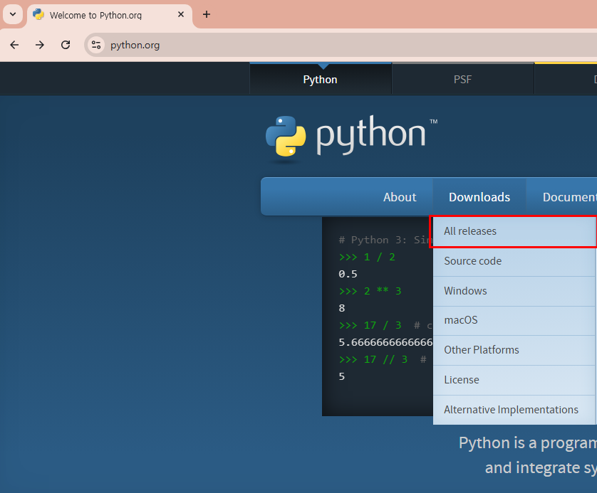
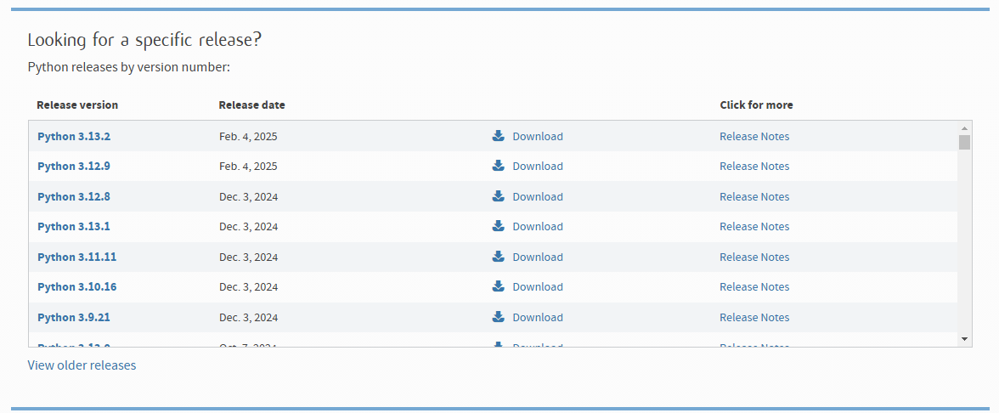
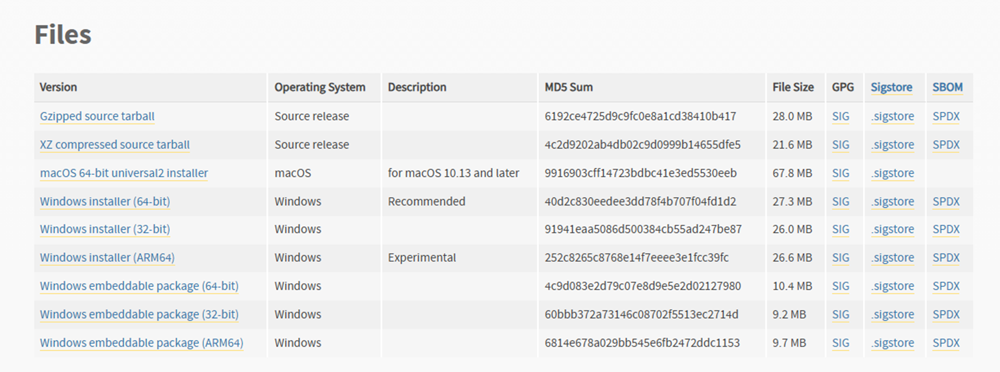
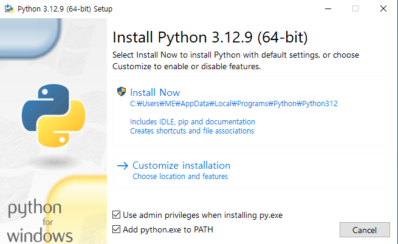
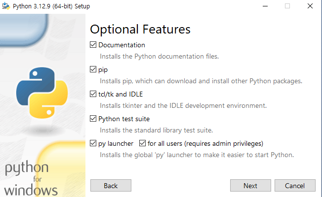
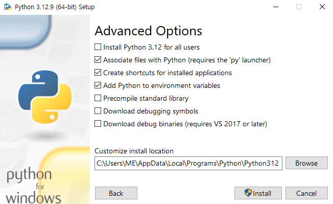
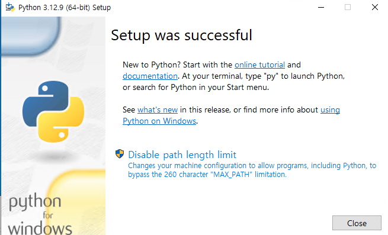
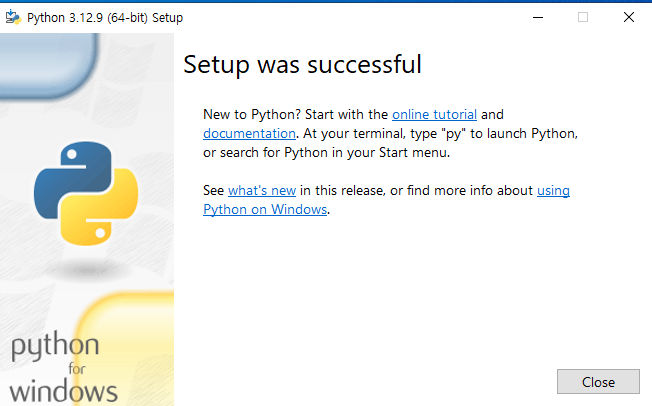

# 파이썬 설치하기  
***
## 파이썬 다운로드  
***
1. 홈페이지 접속 [python.org](https://python.org) -> Download -> All releases  

2. Looking for a specific release? 에서 원하는 버전 Download 선택  

3. Files -> Windows 의 경우 Windows Installer (64-bit) 선택하여 다운로드  


## 파이썬 설치  
***
1. 파이썬 설치  
  
Add python.exe to PATH 를 선택하면 현재 설치하는 버전의 파이썬이 환경변수에 설정된다.  
미체크 시 에는 필요 시 수동으로 설정해야한다.  
  
  
  
설치 완료 시 Disable path length limit 을 선택해준다.  
  

## 설치 버전 확인  
1. 버전 확인  
```commandline
C:\Users\ME>python --version
Python 3.12.9
```
2. 설치된 모든 버전 확인  
```commandline
C:\Users\ME>py -0
 -V:3.13 *        Python 3.13 (64-bit)
 -V:3.12          Python 3.12 (64-bit)
```
3. 설치된 모든 버전과 설치 경로 확인  
```commandline
C:\Users\ME>py -0p
 -V:3.13 *        C:\Users\ME\AppData\Local\Programs\Python\Python313\python.exe
 -V:3.12          C:\Users\ME\AppData\Local\Programs\Python\Python312\python.exe
```