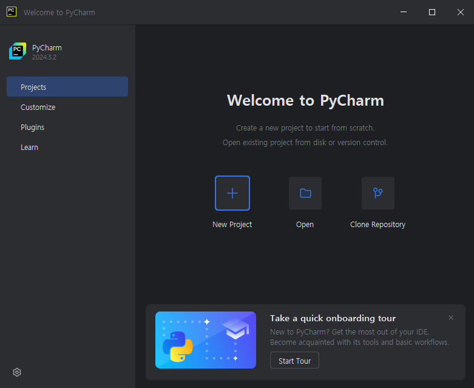

# Pycharm 설치 하기  
***
## Pycharm 다운로드  
***
1. 아래 링크에서 PyCharm Community Edition 다운로드  
[https://www.jetbrains.com/pycharm/download/](https://www.jetbrains.com/pycharm/download/)  
  
## Pycharm 설치  
***
  
  
  
  
  
## Pycharm 실행
  
  
