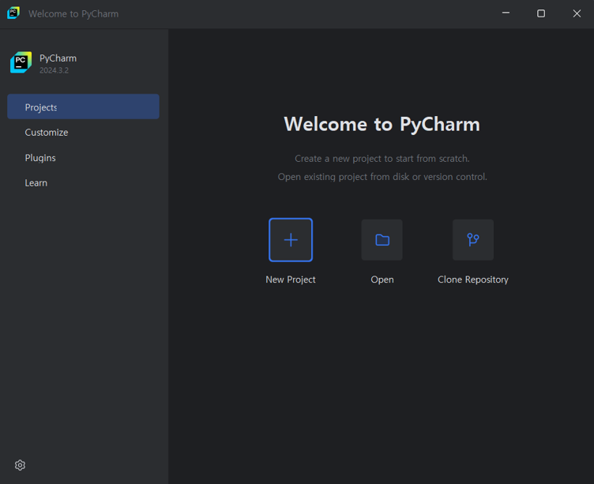

# 문자열 출력하기  

## CMD  
  
1. python 프로그램 실행
2. print 함수 호출
3. 실행 결과

## IDLE  

  
  
1. Windows -> IDLE 검색 -> IDLE (Python ...) 실행
2. 이 후 CMD [2] 부터와 같음

## Pycharm (IDE)  
  
New Project 클릭<br><br>
  
New Project > Pure Python  
Location 마지막 경로를 ds_python_study 로 변경 후 Create<br><br>
  
좌측 네비게이션에 있는 ds_python_study 우클릭 > New > Directory  
Directory 명을 001_Basic_Input_Output 으로 생성<br><br>
  
좌측 네비게이션에 있는 001_Basic_Input_Output 우클릭 > New > File  
파일명을 001_문자열_출력하기.py 로 생성<br><br>
  
위 캡쳐 처럼 코드 작성 후 ▷ 를 클릭하여 코드 실행<br><br>
  
프로그램 하단 터미널에서 코드 실행 결과가 출력된다.

## 기본 함수 사용방법  
함수는 특정 작업을 수행하기 위한 코드 블록이다.  
함수 이름 뒤에 () 괄호를 붙여 함수를 호출할 수 있다.
```python
함수이름()
```
<br>매개변수가 있는 함수는 () 괄호 안에 인자를 넣을 수 있다.  
예를 들어 print 함수의 경우 () 괄호를 비우는 경우 개행이 되고,  
인자를 넣으면 문자열을 출력한다.<br><br>
**Code**  
```python
print("print('문장1')")
print("print()")
print("print('문장2')")
```
**Result**  
```commandline
print('문장1')
print()
print('문장2')
```
<br>Pycharm 의 경우 함수의 () 괄호안에 커서를 두고 Ctrl + q 를 입력하면  
함수에 대한 도움말(매개변수, 타입 힌트, docstring 등)을 볼 수 있다.<br><br>
  

