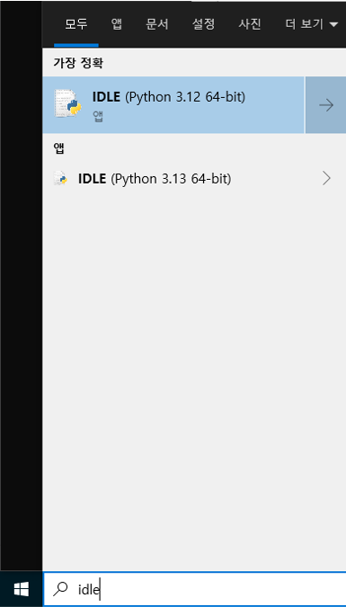
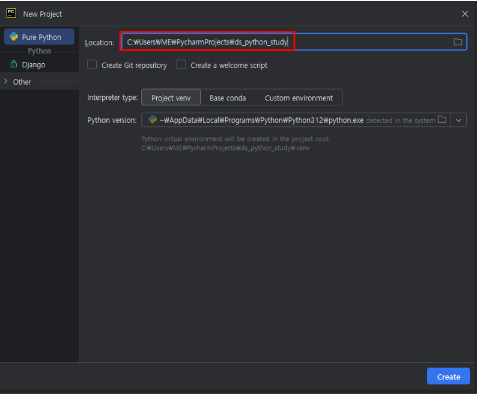

# 문자열 출력하기  

## CMD  
  
1. python 프로그램 실행
2. print 함수 호출
3. 실행 결과

## IDLE  

  
  
1. Windows -> IDLE 검색 -> IDLE (Python ...) 실행
2. 이 후 CMD [2] 부터와 같음

## Pycharm (IDE)  
  
File > New Project  
  
New Project >  
Location 마지막 경로를 ds_python_study 로 변경  
  
좌측 네비게이션에 있는 ds_python_study 우클릭 > New > Directory  
Directory 명을 001_Basic_Input_Output 으로 생성  
  
좌측 네비게이션에 있는 001_Basic_Input_Output 우클릭 > New > File  
파일명을 001_문자열_출력하기.py 로 생성  
  
위 캡쳐 처럼 코드 작성 후 ▷ 를 클릭하여 코드 실행  
  
프로그램 하단 터미널에서 코드 실행 결과가 출력된다.

